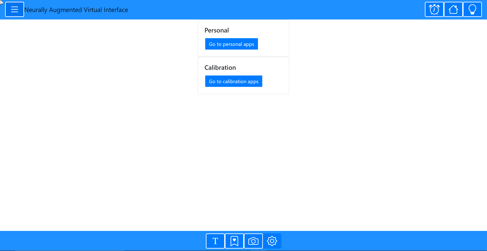

# Neurally Augmented Virtual Interface (NAVI)

## To get started (utilizes all VSCode + Remote Repository extension):
- Open new VSCode Window
- Install these two extensions:
  - Remote Repositories by Github
  - Remote Containers by Microsoft
- In the bottom left press the green button
- Select "Open Remote Repository..." and type "cronelab/NAVI" (probably have to log into Github inside VSCode)
- Press that green button again
- Select "Continue working on..."
- Select "Clone Repository in a Container Volume (This is the step that requires Docker, will take a bit to install and configure the container)
- Open the terminal in VSCode
- Type in "npm i" (installs all NAVIs dependencies)
- Type in "npm run start" (transpiles and serves code)
- Open up "localhost:3000" in your browser
- Enjoy!

## manual build and start up procedure
install Docker extension for VSCode (adds whale icon to the left menu)

to start:
click on the docker icon within Code
under "Image", navigate to corticom/navi, first sub-bullet="latest", right click then "Run interactive"
wait....
under "Containers", click on refresh to see the corticom/navi container
right-click on corticom/navi container and open in browser!

to stop:
right-click on corticom/navi container and click on stop

to refresh:
git pull
docker build . -t corticom/navi:navi
(see "to start" above)

## To do:

- Implement system to ensure the patient is focused on the task
  - Prompt to continue
  - Eye tracking
  - Sleep detection
  - If the patient isn't doing anything, stop the task and throw out the last few trials
- Discard X trials if patient does lose focus
- Speech detection
- unmount components
- Calendar

## Materials to add:
- Videos
  - ~~Steve~~
  - Dan
  - Griff

----
## [System diagram](https://livejohnshopkins-my.sharepoint.com/:p:/g/personal/ccoogan2_jh_edu/EZg1xS9p5zBOh-F-MXQT0YcB7Yt5Mle2cfOjnO7I59ScVw?e=rBfLSD)
## [Unity Communication Board](https://livejohnshopkins-my.sharepoint.com/:v:/g/personal/ccoogan2_jh_edu/EYLUyxGt1pJDiWh_ScffOVwB0Rm9h0tpWMGQQSYwqpr01w?e=NpN1XI)
--------

