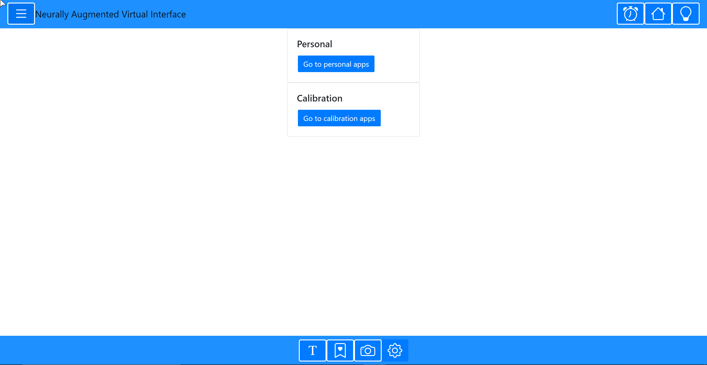

This is a [Next.js](https://nextjs.org/) project bootstrapped with [`create-next-app`](https://github.com/vercel/next.js/tree/canary/packages/create-next-app).

## Getting Started

First, run the development server:

```bash
npm run dev
# or
yarn dev
```

Open [http://localhost:3000](http://localhost:3000) with your browser to see the result.

You can start editing the page by modifying `pages/index.tsx`. The page auto-updates as you edit the file.

[API routes](https://nextjs.org/docs/api-routes/introduction) can be accessed on [http://localhost:3000/api/hello](http://localhost:3000/api/hello). This endpoint can be edited in `pages/api/hello.ts`.

The `pages/api` directory is mapped to `/api/*`. Files in this directory are treated as [API routes](https://nextjs.org/docs/api-routes/introduction) instead of React pages.

## Learn More

To learn more about Next.js, take a look at the following resources:

- [Next.js Documentation](https://nextjs.org/docs) - learn about Next.js features and API.
- [Learn Next.js](https://nextjs.org/learn) - an interactive Next.js tutorial.

You can check out [the Next.js GitHub repository](https://github.com/vercel/next.js/) - your feedback and contributions are welcome!

## Deploy on Vercel

The easiest way to deploy your Next.js app is to use the [Vercel Platform](https://vercel.com/new?utm_medium=default-template&filter=next.js&utm_source=create-next-app&utm_campaign=create-next-app-readme) from the creators of Next.js.

Check out our [Next.js deployment documentation](https://nextjs.org/docs/deployment) for more details.


# Neurally Augmented Virtual Interface (NAVI)


## To get started (utilizes all VSCode + Remote Repository extension):
- Open new VSCode Window
- Install these two extensions:
  - Remote Repositories by Github
  - Remote Containers by Microsoft
- In the bottom left press the green button
- Select "Open Remote Repository..." and type "cronelab/NAVI" (probably have to log into Github inside VSCode)
- Press that green button again
- Select "Continue working on..."
- Select "Clone Repository in a Container Volume (This is the step that requires Docker, will take a bit to install and configure the container)
- Open the terminal in VSCode
- Type in "npm i" (installs all NAVIs dependencies)
- Type in "npm run start" (transpiles and serves code)
- Open up "localhost:3000" in your browser
- Enjoy!

## manual build and start up procedure
install Docker extension for VSCode (adds whale icon to the left menu)

to start:
click on the docker icon within Code
under "Image", navigate to corticom/navi, first sub-bullet="latest", right click then "Run interactive"
wait....
under "Containers", click on refresh to see the corticom/navi container
right-click on corticom/navi container and open in browser!

to stop:
right-click on corticom/navi container and click on stop

to refresh:
git pull
docker build . -t corticom/navi:navi
(see "to start" above)

## To do:

- Implement system to ensure the patient is focused on the task
  - Prompt to continue
  - Eye tracking
  - Sleep detection
  - If the patient isn't doing anything, stop the task and throw out the last few trials
- Discard X trials if patient does lose focus
- Speech detection
- unmount components
- Calendar

## Materials to add:
- Videos
  - ~~Steve~~
  - Dan
  - Griff

----
## [System diagram](https://livejohnshopkins-my.sharepoint.com/:p:/g/personal/ccoogan2_jh_edu/EZg1xS9p5zBOh-F-MXQT0YcB7Yt5Mle2cfOjnO7I59ScVw?e=rBfLSD)
## [Unity Communication Board](https://livejohnshopkins-my.sharepoint.com/:v:/g/personal/ccoogan2_jh_edu/EYLUyxGt1pJDiWh_ScffOVwB0Rm9h0tpWMGQQSYwqpr01w?e=NpN1XI)
--------

