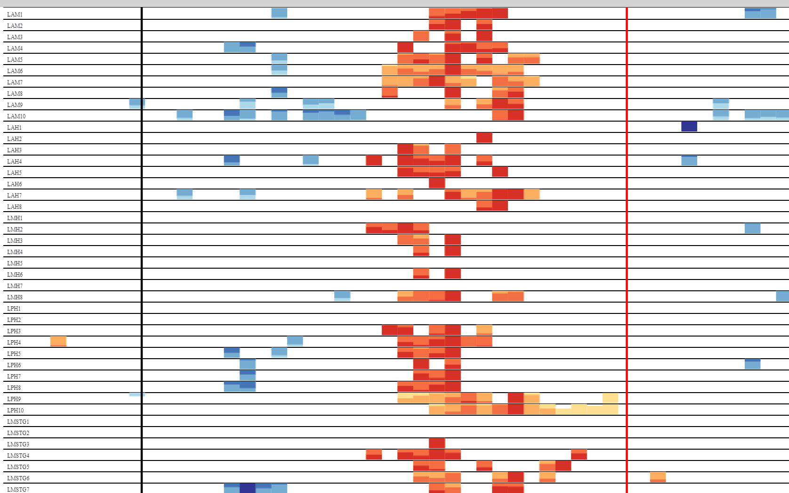

Functional Mapping
==============================================

.. code-block:: json

    {
        "metadata": {
            "kind": "high gamma power",
            "labels": [
                "timeseries"
            ],
            "subject": "PY20N012",
            "setting": {
                "task": "AF_AuditoryNaming"
            },
            "sensorGeometry": {
                "LAM1": {
                    "u": 0.439044481054366,
                    "v": 0.111197511664075
                }
            },
            "baselineWindow": {
                "start": -1,
                "end": -0.2
            },
            "montage": [
                "LAM1"
            ],
            "_import": "./.metadata"
        },
        "contents": {
            "times": [
                -1,0,1,2,3
            ],
            "stats": {
                "distribution": "gaussian",
                "baseline": {
                    "mean": {
                        "LAM1": 6.889289109511145
                    },
                    "variance": {
                        "LAM1": 18.550886629213892
                    },
                    "count": {
                        "LAM1": 539
                    }
                },
                "estimators": {
                    "mean": {
                        "LAM1": [
                            6.896442395752791, 4.2134
                        ],
                        "LAM2": [
                            8.030720808554669,
                            7.106620614017761
                        ]
                    },
                    "variance": {
                        "LAM1": [
                            16.527743202226223,
                            9.825520843532209
                        ],
                        "LAM2": [
                            19.383190411625122,
                            19.276977897600933
                        ]
                    },
                    "count": {
                        "LAM1": [
                            49,
                            49
                        ],
                        "LAM2": [
                            49,
                            49

                        ]
                    }
                }
            },
            "trials": [
                {
                    "LAM1": [
                        20.621515941619876,
                        17.842535400390627
                    ],
                    "LAM2": [
                        7.513596487045289,
                        17.029266548156738
                    ]
                },
                {
                    "LAM1": [
                        8.29588451385498,
                        4.208327674865723
                    ],
                    "LAM2": [
                        2.2676062107086183,
                        1.4714530229568483
                    ]
                }
            ],
            "stimulus": [
                "0",
                "42",
                "33"
            ]
        }
    }